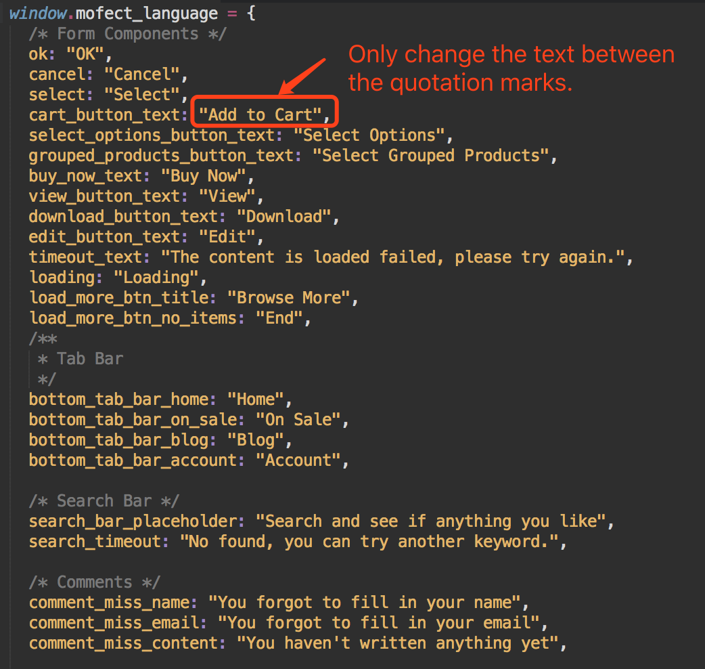

# Localization

The language file is included both in the build\(or public\)/language folder,  you can only edit build/language/lang.js but we suggest you to copy the modified version to public/language folder as well. Otherwise, if you made some secondary development and rebuild the App with NPM, the build/language/lang.js will be overwrite.

Let's open lang.js. You can only change the text between the quotation marks as the screenshot shows to you, do not change the variable name.

After you changed the lang.js, just refresh the App pages, you will see the changes.

