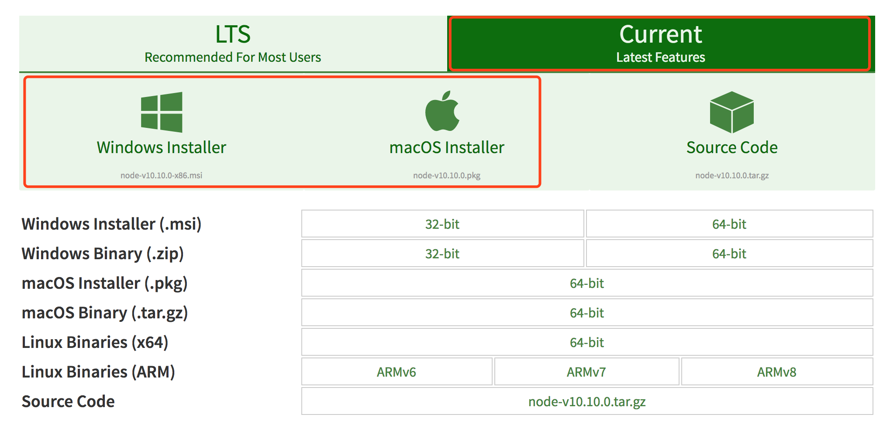

# Install Tools

### Install Node.js & NPM

You can get the installer from [nodejs.org](https://nodejs.org/en/download/), please download the current version for your computer OS. Then, install it as same as the normal software.



### Test Node.js & NPM

After you have installed node.js with npm, you can confirm that the two are installed by issuing either command with a -v flag to check the version: 

**Mac OS:** search "Terminal" in spotlight search and open the Terminal App on your Mac. 

**Windows**: search "CMD" and open it.

Run the following a couple of commands one by one:

```text
node -v
```

```text
npm -v
```

If you can get the correct version, it means everything is OK. 

