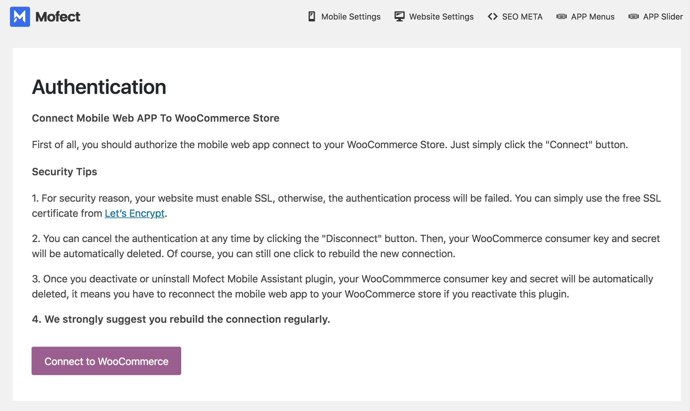

# Quick Installation

### 1. Unzip The Package File

Unzip the package file which you have downloaded, you will get these three parts:

Mostore source code files are included in the _**App\_V1.x**_ folder, it's prepare for the developers. If you are a non-technique user, you can ignore App folder, and go straight to install Mostore App with WordPress Helper Plugin: **Mofect mobile assistant** which is included in the _**WordPress Helper Plugin**_ folder.

### 2. Install Mofect Mobile Plugin

The next important step is install Mofect Mobile plugin on your WordPress. This helper plugin offers some import extended REST API endpoints to makes the Mobile App launch as normal.

* Log in your WordPress backend with administrator account. 
* Go to Plugins &gt; Install plugin page, upload mofect-mobile.zip file and activate the plugin.

### 3. Connect WooCommerce Rest API

Once the plugin is activated, the page will be redirected to the Authentication screen. 

Before you click the big button to connect App to your WooCommerce, you should know the following tips:

* 1. For security reason, your website must enable SSL, otherwise, the authentication process will be failed. You can simply use the free SSL certificate from [Let’s Encrypt](https://letsencrypt.org/).
* 2. You must log in the administrator account.
* 3. You can cancel the authentication at any time by clicking the "Disconnect" button. Then, your WooCommerce consumer key and secret will be automatically deleted. Of course, you can still one click to rebuild the new connection.
* 4. Once you deactivate or uninstall Mofect Mobile plugin, your WooCommmerce consumer key and secret will be automatically deleted, it means you have to reconnect the mobile web app to your WooCommerce store if you reactivate this plugin.
* **4. We strongly suggest you rebuild the connection regularly.**

OK, do it! Click the connect button, and approve the authentication request.

### 4. Install App

Go to the next step, install App.

App installation is almost as same as you install a WordPress theme, just upload mostore.zip and activate it.

That's it! If you back to the plugin dashboard page, you will see the mobile app preview, URL and deployed path.

OK, in the next section, we will introduce you how to configure the App with Mofect Mobile plugin.

